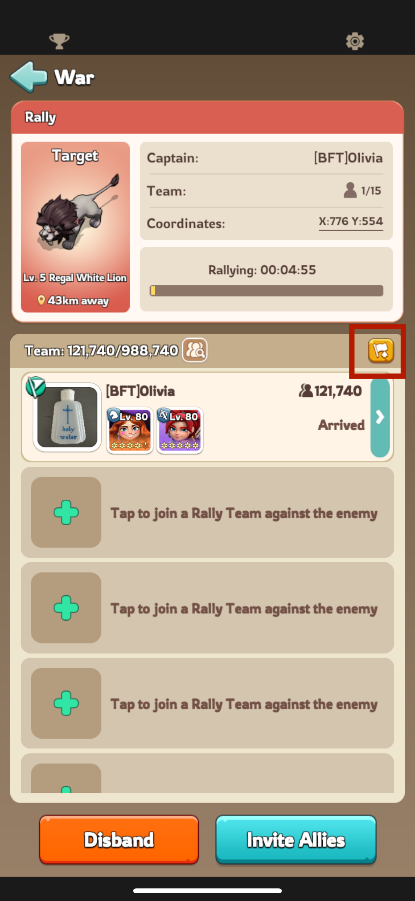
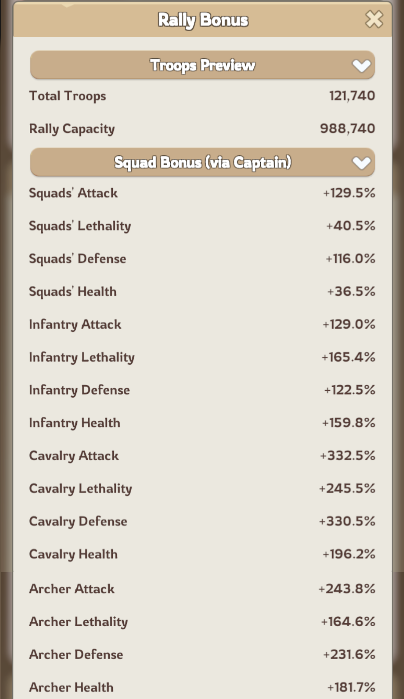
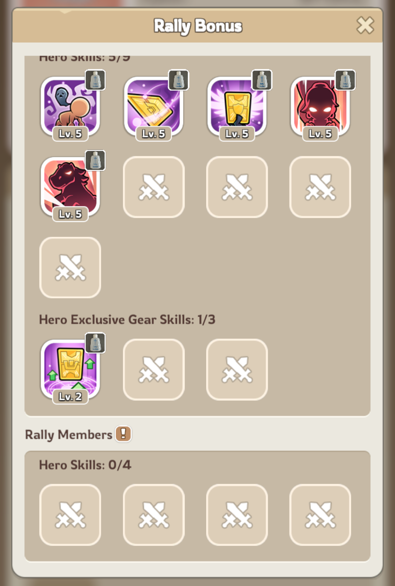
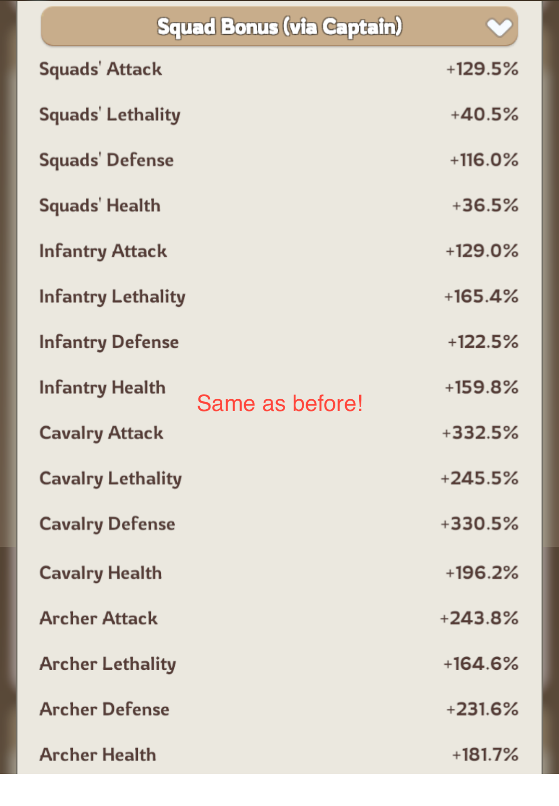
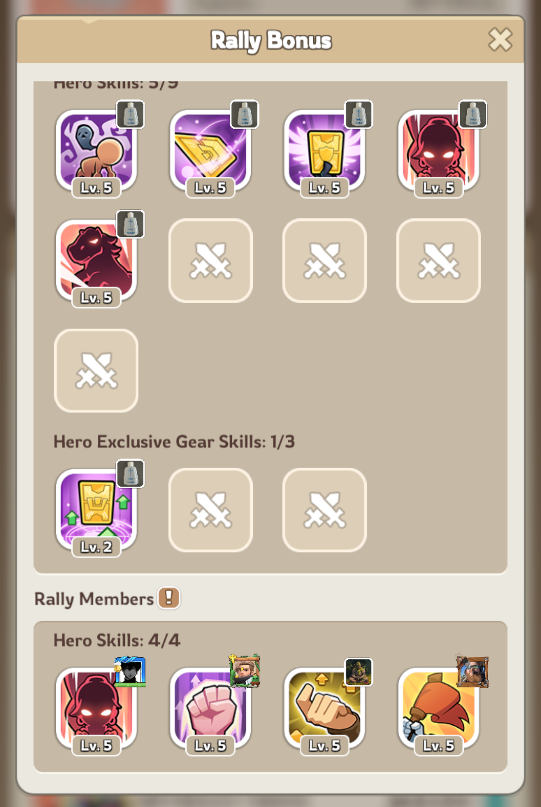
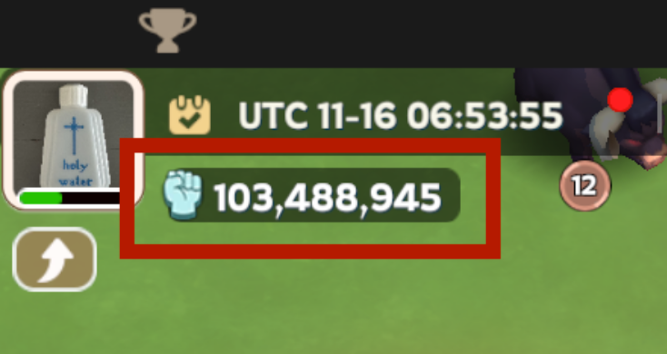
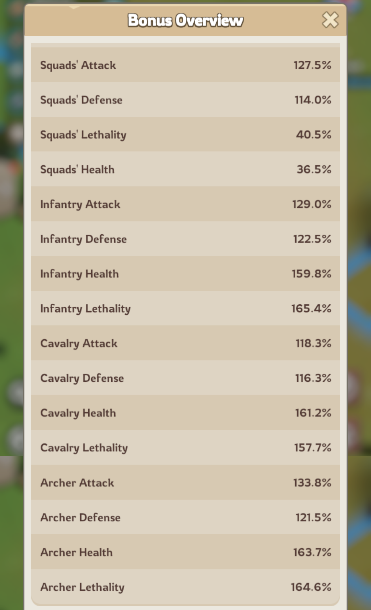
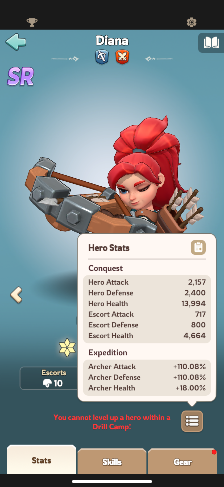
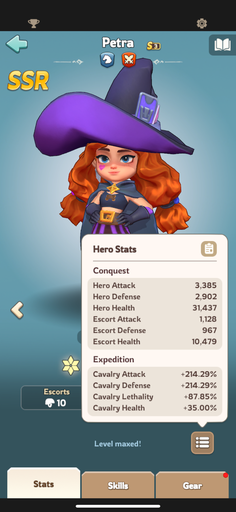

# Basic Rally Guide - THIS IS NOT DONE YET!

I started a rally to show how you can check exactly which stats and skills will be used in it.

<table>
  <tr><td> 

  
</td><td>
The rally is still empty, so only my stats and heroes and being used. If you click in the flag in the figure, a different window will open with the rally details. Below there are screeshots of the parts you should check. On the left, you can see the stats that were applied when the rally was still empty; on the right there are screenshots of the same information, but after other peopled joined. 

</td></tr>
</table>

<table>
  <tr><td> 

  
</td><td> 

  
</td><td> 

  
</td><td> 

  
</td></tr>
<td colspan="2">Here, the rally was still empty. The stats in the "squad bonus" accounts for all my governor gear, research, etc. It also includes stats boosts from the heroes I sent. You can also check the information about my heroes' skills that are being applied. </td><td colspan="2">Here, people started to join the rally. Note that the "squad bonus" is exactly the same as before (and this is what we mean when we say that "the joiners will use the stats from the captain"). The only difference is the 4 joiner skills that were added. </td>
</table>

## What exactly is the squad bonus 

The squad bonus includes the stats from the "bonus overview", the Expedition stats from the heroes you used in the rally and their gears. You can check your bonus overview by clicking here:

  

<table>
  <tr><td>
If you scroll down, you'll find the military section with your stats. These stats are applied to all your rallies. Those are smaller than the ones that appeared in the rally squad bonus, because the squad bonus also includes heroes and gear stats. Check below my hero stats that where included. 

</td><td> 

  
</td></tr>
</table>

<table>
  <tr><td> 

  
</td><td> 

  
</td><td>
The stats that will count for rallies are always only the "Expedition" stats. You can forget about the "Conquest" stats, those are only used in Arena and Conquest Battles. Those stats already account for the gear that is equipped in the hero.

</td></tr>
</table>

Let's add all these things together:

|               | Bonus Overview    | Hero and Gear Stats| Sum      |
|-              | -------------     | -------------      |--        |
|Inf. Attack    |  129.0%           |                    |129.0%    |
|Inf. Defense   |  122.5%           |                    |122.5%    |
|Inf. Health    |  159.8%           |                    |159.8%    |
|Inf. Lethality |  165.4%           |                    |165.4%    |
|Cav. Attack    |  118.3%           | 214.29%            |332.59%   |
|Cav. Defense   |  116.3%           | 214.29%            |330.59%   |
|Cav. Health    |  161.2%           | 35.00%             |196.2%    |
|Cav. Lethality |  157.7%           | 87.85%             |245.55    | 
|Arc. Attack    |  133.8%           | 110.08%            |243.88%   |
|Arc. Defense   |  121.5%           | 110.08%            |231.58%   |
|Arc. Health    |  163.7%           | 18.00%             |181.7%    |
|Arc. Lethality |  164.6%           |                    |164.6%    |

Note that the last column matches the squad bonus. Obs: the squad stats in the bonus overview and in the squad bonus are different by 2%. This is because I have a Helga Bonus which adds 2% to attack and defense even in her absence.

TO BE CONTINUED
